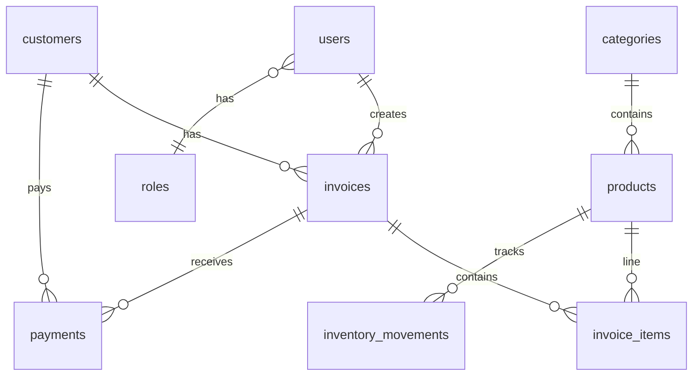

# POS + Inventory + Customer Debt (Laravel)

## Current state

- Existing app: [composer.json](/var/www/POS/composer.json) shows **Laravel 8.75**, PHP `^7.3|^8.0`, Laravel Mix, no domain migrations beyond defaults ([database/migrations](/var/www/POS/database/migrations)), [routes/web.php](/var/www/POS/routes/web.php) only serves `welcome`.
- Your requirement says **Laravel latest**; the plan assumes **Phase 0** upgrades the project to **Laravel 10 or 11** (PHP 8.1+ / 8.2+ per Laravel docs) and adopts **Vite** for assets, unless the server PHP version blocks it—in that case, implement the same architecture on Laravel 8 and add a follow-up upgrade.

## Phase 0: Framework and UI baseline

- Bump PHP/composer constraints and run Laravel’s upgrade path (8 → … → target), replace Mix with Vite if upgrading.
- Add **session auth** for admin: Laravel Breeze (Blade) is Tailwind-first; for **Bootstrap 5** specifically, either:
  - **Option A (recommended for your stack):** Breeze Blade + swap compiled CSS to Bootstrap 5 (more work), or
  - **Option B:** `laravel/ui` bootstrap auth on L8 only (if you stay on 8)—faster but older pattern.
- Install packages (after PHP/Laravel version is fixed):
  - **PDF:** `barryvdh/laravel-dompdf` (or `spatie/laravel-pdf` if you prefer Chromium-based).
  - **Excel:** `maatwebsite/excel` for report exports.
- Layout: `resources/views/layouts/admin.blade.php` + **sidebar**, flash/toast via session + small JS helper; **dark mode** optional via `data-bs-theme` toggle persisted in `localStorage`.

## 1. Database design (ERD)

Core entities and relationships:

**Tables and key columns**

| Table | Purpose |
|--------|--------|
| `roles` | `id`, `name`, `slug` (seed: `admin`, `cashier` for future) |
| `users` | add `role_id` (nullable FK), keep `name`, `email`, `password` |
| `categories` | `name`, `description` |
| `products` | `name`, `sku` (unique), `category_id`, `description`, `wholesale_price`, `retail_price`, `purchase_price`, `stock_quantity`, `minimum_stock_alert`, `image_path`, `barcode` (nullable unique), `status` (active/inactive), timestamps |
| `customers` | `name`, `phone`, `address`, `notes`, `total_debt` (denormalized cache), timestamps |
| `invoices` | `invoice_number` (unique), `customer_id`, `pricing_type` (`retail` \| `wholesale`), `subtotal`, `discount_amount`, `tax_rate` (nullable), `tax_amount`, `total`, `paid_amount`, `remaining_amount`, `payment_status` (`paid` \| `partially_paid` \| `unpaid`), `notes`, `created_by` (FK users), timestamps |
| `invoice_items` | `invoice_id`, `product_id`, `quantity`, `unit_price`, `unit_cost` (snapshot of cost at sale for profit reports), `line_total` |
| `payments` | `customer_id`, `invoice_id` (nullable only if you allow “unallocated” payments—default **required** for clarity), `amount`, `payment_method`, `notes`, `payment_date`, `created_by`, timestamps |
| `inventory_movements` | `product_id`, `type` (`sale` \| `adjustment` \| `restock`), `quantity` (signed: negative reduces stock for sales in DB, or always positive with direction—pick one convention and stick to it), `reference_type`/`reference_id` (polymorphic to invoice/item), `notes`, timestamps |

**Design choices (important for correctness)**

- **Stock:** On invoice commit, decrement `products.stock_quantity` inside a **DB transaction** with `lockForUpdate()` on touched product rows; validate `quantity <= stock` before insert.
- **COGS / profit:** Store `unit_cost` on `invoice_items` at sale time (copy from `products.purchase_price`) so profit reports stay accurate if purchase prices change later.
- **`customers.total_debt`:** Maintain in the same transaction as invoice save and payment save: e.g. `total_debt = sum(invoices.remaining_amount)` for that customer, or delta updates—either way **one service owns the write path** to avoid drift.
- **Invoice numbering:** Generate in transaction (e.g. `INV-YYYY-#####`) with unique index; handle race with retry or DB sequence pattern.
- **Payment vs invoice:** When a payment is recorded for an invoice, increase `invoices.paid_amount`, recompute `remaining_amount` and `payment_status`, then sync `customers.total_debt`.

## 2. Migrations order

1. `roles`, alter `users` (`role_id`)
2. `categories`, `products`, `customers`
3. `invoices`, `invoice_items`
4. `payments`
5. `inventory_movements` (indexes on `product_id`, `created_at`, `type`)

## 3. Models and relationships

- [app/Models](/var/www/POS/app/Models): `Role`, `Category`, `Product`, `Customer`, `Invoice`, `InvoiceItem`, `Payment`, `InventoryMovement`; extend `User` with `role()` and `createdInvoices()`.
- Eloquent: `$casts` for decimals/dates; `$fillable` guarded appropriately; `Invoice` `hasMany` items/payments; `Product` `hasMany` movements; polymorphic optional on movements for traceability.

## 4. Validation and HTTP layer

- **Form Requests** per resource: `StoreProductRequest`, `UpdateProductRequest`, `StoreInvoiceRequest`, `StorePaymentRequest`, etc.
- **Controllers** grouped under `App\Http\Controllers\Admin\` (or `App\Http\Controllers\` + route prefix): Dashboard, Category, Product, Customer, Invoice (POS), Payment, Report, InventoryMovement (adjust/restock).
- **Policies** or middleware: for now gate all admin routes with `auth` + single `admin` middleware checking `role.slug === 'admin'` (cashier stub for later).

## 5. Services (write paths)

Keep controllers thin; use dedicated services (plain classes, constructor-injected):

- **`InvoiceService`:** validate stock, compute line totals from `pricing_type`, apply discount/tax, persist invoice + items, create `inventory_movement` rows type `sale`, decrement stock, set payment fields if initial `paid_amount` on checkout, update `customer.total_debt`.
- **`PaymentService`:** validate payment `<= remaining_amount` (unless you explicitly allow overpayment to credit), update invoice paid fields + status, update customer debt, optionally log movement if you treat returns separately later.
- **`InventoryService`:** manual `adjustment` and `restock` with quantity rules and notes; never bypass stock without a movement row.

Use **`DB::transaction()`** + row locks in both invoice and payment services.

## 6. Routes and UI modules (implementation order)

You asked to proceed **module by module**; recommended sequence:

1. **Auth + layout** — login, admin layout, sidebar, flash toasts.
2. **Dashboard** — cards: today sales sum, today profit (from `invoice_items` using `unit_cost`), pending debts (`sum(customers.total_debt)` or unpaid invoices), product count, low stock list (`stock_quantity <= minimum_stock_alert`), latest invoices/payments (eager-loaded lists).
3. **Categories CRUD** — table + modal or full pages; reuse Blade components (`x-admin.table`, `x-admin.form-input`).
4. **Products CRUD** — image upload to `storage/app/public/products` + symlink; search/filter (category, status, low stock); optional AJAX SKU lookup for POS.
5. **Customers CRUD + profile** — tabs: invoices, payments, summary card for remaining debt (from invoices aggregate + `total_debt` consistency check in dev).
6. **POS / Invoices** — multi-line UI (Bootstrap table + JS to add rows); server-side totals; optional **AJAX** endpoints: `GET /api/admin/products/search?q=` and barcode endpoint; **print** view (`resources/views/admin/invoices/print.blade.php`) + **PDF** route using DomPDF.
7. **Payments** — form to pay against invoice; partial payments; list filtered by customer/date.
8. **Inventory movements** — list + forms for adjustment/restock (writes via `InventoryService`).
9. **Reports** — query scopes by date; pages: daily sales, monthly sales, profit (revenue − COGS from `unit_cost`), inventory snapshot, debts by customer, top products by `sum(invoice_items.quantity)` in range. Add **Export Excel/PDF** buttons per report.
10. **Optional:** barcode field + scan-to-add in POS; receipt CSS tuned for 80mm; dark mode toggle.

## 7. Seeders

- `RoleSeeder`, `AdminUserSeeder` (assign admin role)
- `CategorySeeder`, `ProductSeeder`, optional `CustomerSeeder` for demo

## 8. Code organization (folders)

- `app/Http/Controllers/Admin/`
- `app/Http/Requests/Admin/`
- `app/Services/`
- `resources/views/admin/{dashboard,categories,products,customers,invoices,payments,reports,inventory}/`
- `resources/views/components/admin/` — buttons, alerts, pagination wrapper

## 9. Testing and quality (production-minded)

- Feature tests for: cannot oversell stock; invoice totals; payment reduces remaining; debt consistency after payment; inventory movement created on sale.
- `.env` MySQL config; `php artisan storage:link` documented for images.

## Risk / decision note

- **Laravel “latest” vs repo L8:** upgrading first avoids rework on Mix/auth scaffolding; if you must stay on PHP 7.x, we keep L8 and use `laravel/ui` + same domain design.

## Deliverables checklist

- Migrations + models + relationships + seeders
- Auth + role-ready users
- Full admin UI (responsive, sidebar, tables, validation, toasts)
- POS invoices with stock rules, print + PDF
- Payments + debt tracking
- Inventory movements (sale auto + manual)
- Reports + optional exports, optional barcode/dark mode
